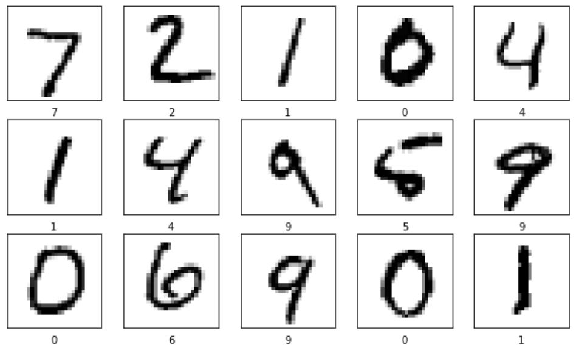
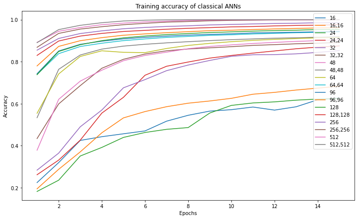

# A simple Implementation of an SNN
## Neurodynamics Project - Group 10
This project was created as part of the Neurodynamics lecture at the _University Osnabrück, Germany_. It contains a simple from scratch implementation of a Spiking-Neural-Network with STDP in Python

(<a href="#top">back to top</a>)

## 📖 Table of Contents
  - [❓ Why?](#-why)
  - [✨ Features](#-features)
  - [💻 Usage](#-usage)
  - [💾 Structure](#-structure)
  - [🚫 Limitations](#-limitations)
  - [📃 Paper](#-paper)
  - [📝 Authors](#-authors)
  - [📎 License](#-license)
  
(<a href="#top">back to top</a>)

## ❓ Why?
Artificial Neural Networks (ANNs) are only loosely inspired by the human brain while Spiking Neural Networks (SNNs) incorporate various concepts of it.
Spike Time Dependent Plasticity (STDP) is one of the most commonly used biologically inspired unsupervised learning rules for SNNs. 
In order to obtain a better understanding of SNNs we compared their performance in image classification to Fully-Connected ANNs using the MNIST dataset.   
   
For this to work, we had to transform the data for the SNN into rate-encoded spike trains.
As a major part of our work, we provide a comprehensible implementation of an STDP-based SNN.

(<a href="#top">back to top</a>)

## ✨ Features
To-Do: Add list of features

(<a href="#top">back to top</a>)

## 💻 Usage
To-Do: Add usage description

(<a href="#top">back to top</a>)

## 💾 Structure
<!-- Project Structure -->

    .
    ├── src                    
    │   ├── MNIST                              # Here is the entire MNIST dataset          
    │   │   ├── testing
    │   │   │   ├── 0                          # Each subfolder represents a class
    │   │   │   │   ├── 3.png
    │   │   │   │   ├── 10.png
    │   │   │   │   ├── 13.png
    │   │   │   │   ...
    │   │   │   ├── 1
    │   │   │   ├── 2
    │   │   │   ├── 3
    │   │   │   ├── 4
    │   │   │   ├── 5
    │   │   │   ├── 6
    │   │   │   ├── 7
    │   │   │   ├── 8
    │   │   │   ├── 9
    │   │   ├── training
    │   │   │   ├── 0
    │   │   │   ...
    │   │   ├── labels.csv
    │── .gitignore
    │── LICENSE
    │── SNN.py                    # The main py-file for training and testing the SNN
    │── ANN_Comparison.ipynb      # The classical ANNs are being trained in Tensorflow
    │── Visualization.ipynb
    │── README.md
    └── requirements.txt

(<a href="#top">back to top</a>)

## 🚫 Limitations
- No hidden layers implemented
- Convertions into Spike Trains works only with GreyScale
- Long training times
- Didn't use the entire MNIST dataset for training

(<a href="#top">back to top</a>)

## 📃 Paper
If you are interested in the exact hyperparameters we used or want to get more details in general, we also uploaded the accompanying term paper, which we wrote for this lecture. Still here are some of our results we achieved: 
 | 
In general our results showed that our implementation of an Spiking Neural Networks got a pretty good classification performance after only one epoch of training. But it didn't improve much beyond that and it was handely beaten by a classical ANN of similiar size using Dense layers after a few training epochs. Furthermore the SNNs didn't profit from more Neurons as much as the classical ANNs with Dense Layers did.

(<a href="#top">back to top</a>)

## 📝 Authors
[Peter Keffer](pkeffer@uos.de) 
[Leonie Grafweg](grafweg@uos.de) 
[Paula Heupel](pheupel@uos.de) 
[Cornelius Wolff](cowolff@uos.de) 

(<a href="#top">back to top</a>)

## 📎 License
Copyright 2022 Cornelius Wolff, Paula Heupel, Leonie Grafweg, Peter Keffer

Licensed under the Apache License, Version 2.0 (the "License");
you may not use this file except in compliance with the License.
You may obtain a copy of the License at

    http://www.apache.org/licenses/LICENSE-2.0

Unless required by applicable law or agreed to in writing, software
distributed under the License is distributed on an "AS IS" BASIS,
WITHOUT WARRANTIES OR CONDITIONS OF ANY KIND, either express or implied.
See the License for the specific language governing permissions and
limitations under the License.

(<a href="#top">back to top</a>)

